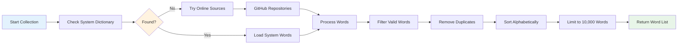

# Word List Blockchain: Research Applications and Technical Documentation

## Overview

The Word List Blockchain system creates cryptographically secure, timestamped snapshots of English vocabulary at specific points in time. This innovative approach combines blockchain technology with linguistic research to provide immutable records of language evolution and vocabulary preservation.

## How It Works

```mermaid
graph TD
    A[User Input: Date] --> B[Word Collection Process]
    B --> C{Word Sources}
    
    C --> D[System Dictionary<br/>/usr/share/dict/words]
    C --> E[Online Sources<br/>GitHub Repositories]
    C --> F[Fallback List<br/>Basic English Words]
    
    D --> G[Word Processing]
    E --> G
    F --> G
    
    G --> H[Remove Duplicates<br/>Sort Alphabetically<br/>Filter Valid Words]
    H --> I[Create Genesis Block]
    
    I --> J[Block Structure]
    J --> K[Index: 0<br/>Word List: 10,000+ words<br/>Date: User-specified<br/>Previous Hash: "0"]
    
    K --> L[Proof of Work Mining]
    L --> M[Calculate SHA-256 Hash<br/>Find Nonce for Target Difficulty]
    M --> N[Genesis Block Complete]
    
    N --> O[Blockchain Created]
    O --> P[Add User Data Blocks]
    P --> Q[Chain Validation]
    Q --> R[Save to JSON File]
    
    style A fill:#e1f5fe
    style N fill:#c8e6c9
    style O fill:#fff3e0
    style R fill:#f3e5f5
```

## Research Applications

### 1. Language Evolution Studies

**Purpose**: Track vocabulary changes over time to understand language evolution patterns.

**Methodology**:
- Create blockchains for different historical dates
- Compare word lists across time periods
- Analyze vocabulary growth, obsolescence, and semantic shifts

**Example Research Questions**:
- How has English vocabulary expanded over the past decade?
- Which words have become obsolete since 2000?
- What new categories of words have emerged in recent years?

```python
# Research Example: Language Evolution Analysis
from wordlist_blockchain import create_word_list_blockchain

# Create blockchains for different time periods
blockchains = {}
dates = ["2010-01-01", "2015-01-01", "2020-01-01", "2025-01-01"]

for date in dates:
    blockchain = create_word_list_blockchain(date, difficulty=1)
    blockchains[date] = blockchain.chain[0].word_list

# Analyze vocabulary changes
for i in range(len(dates)-1):
    old_words = set(blockchains[dates[i]])
    new_words = set(blockchains[dates[i+1]])
    
    added_words = new_words - old_words
    removed_words = old_words - new_words
    
    print(f"Period {dates[i]} to {dates[i+1]}:")
    print(f"  Added: {len(added_words)} words")
    print(f"  Removed: {len(removed_words)} words")
```

### 2. Linguistic Data Preservation

**Purpose**: Create immutable, timestamped records of language states for future research.

**Benefits**:
- **Cryptographic Integrity**: Hash-based verification ensures data hasn't been tampered with
- **Timestamped Snapshots**: Each blockchain is tied to a specific date
- **Decentralized Storage**: Can be distributed across multiple locations
- **Long-term Preservation**: JSON format ensures long-term accessibility

**Use Cases**:
- Academic research repositories
- Language documentation projects
- Historical linguistics studies
- Endangered language preservation

### 3. Educational Research

**Purpose**: Study vocabulary acquisition and language learning patterns.

**Applications**:
- **Vocabulary Assessment**: Create standardized word lists for testing
- **Learning Progress Tracking**: Monitor vocabulary expansion over time
- **Curriculum Development**: Design language learning materials based on word frequency
- **Cross-linguistic Studies**: Compare vocabulary across different languages

### 4. Computational Linguistics

**Purpose**: Provide reliable datasets for natural language processing research.

**Research Areas**:
- **Word Embedding Analysis**: Study semantic relationships in vocabulary
- **Text Classification**: Develop models based on comprehensive word lists
- **Language Modeling**: Train models on verified vocabulary datasets
- **Corpus Linguistics**: Analyze word frequency and distribution patterns

## Technical Architecture

### Block Structure

Each block in the word list blockchain contains:

```json
{
  "index": 0,
  "word_list": ["word1", "word2", "word3", ...],
  "date_str": "2024-01-15",
  "source": "system_dictionary",
  "word_count": 10000,
  "previous_hash": "0",
  "timestamp": 1705276800.0,
  "nonce": 1234,
  "hash": "0000a1b2c3d4e5f6..."
}
```

### Cryptographic Security

1. **SHA-256 Hashing**: Each block is hashed using SHA-256 algorithm
2. **Proof of Work**: Blocks must be mined with computational effort
3. **Chain Linking**: Each block references the previous block's hash
4. **Tamper Detection**: Any modification breaks the chain validation

### Word Collection Process



## Research Methodology

### Data Collection Protocol

1. **Date Specification**: Each blockchain is created for a specific date
2. **Source Documentation**: Track the origin of word lists
3. **Quality Control**: Filter out non-alphabetic and invalid entries
4. **Standardization**: Ensure consistent formatting across collections

### Validation Process

1. **Hash Verification**: Verify block integrity using cryptographic hashes
2. **Chain Validation**: Ensure all blocks are properly linked
3. **Data Consistency**: Check for duplicate or corrupted entries
4. **Source Verification**: Validate word list sources and completeness

### Analysis Framework

```python
class WordListAnalyzer:
    def __init__(self, blockchain):
        self.blockchain = blockchain
        self.words = blockchain.chain[0].word_list
    
    def vocabulary_statistics(self):
        """Calculate comprehensive vocabulary statistics"""
        return {
            'total_words': len(self.words),
            'average_length': sum(len(w) for w in self.words) / len(self.words),
            'length_distribution': self._length_distribution(),
            'alphabetical_distribution': self._alphabetical_distribution(),
            'common_prefixes': self._common_prefixes(),
            'common_suffixes': self._common_suffixes()
        }
    
    def compare_with_other_list(self, other_words):
        """Compare this word list with another"""
        this_set = set(self.words)
        other_set = set(other_words)
        
        return {
            'common_words': len(this_set & other_set),
            'unique_to_this': len(this_set - other_set),
            'unique_to_other': len(other_set - this_set),
            'similarity_score': len(this_set & other_set) / len(this_set | other_set)
        }
```

## Research Use Cases

### 1. Historical Linguistics

**Research Question**: How has English vocabulary evolved over the past century?

**Methodology**:
- Create blockchains for historical dates (1920, 1950, 1980, 2010, 2024)
- Analyze vocabulary changes between periods
- Identify patterns in word adoption and obsolescence

**Expected Outcomes**:
- Timeline of vocabulary expansion
- Identification of technological and cultural influences
- Analysis of semantic field development

### 2. Educational Technology

**Research Question**: How can blockchain-verified word lists improve language learning?

**Methodology**:
- Create standardized word lists for different proficiency levels
- Implement blockchain verification in language learning platforms
- Track student progress using immutable records

**Expected Outcomes**:
- Improved vocabulary assessment tools
- Enhanced learning analytics
- Better curriculum development frameworks

### 3. Computational Linguistics

**Research Question**: How do comprehensive word lists improve NLP model performance?

**Methodology**:
- Train language models on blockchain-verified word lists
- Compare performance with models trained on unverified data
- Analyze the impact of data quality on model accuracy

**Expected Outcomes**:
- Improved model reliability
- Better understanding of data quality importance
- Enhanced NLP applications

## Data Management

### Storage Format

Blockchains are stored in JSON format for maximum compatibility:

```json
{
  "chain": [
    {
      "index": 0,
      "word_list": ["word1", "word2", ...],
      "date_str": "2024-01-15",
      "source": "system_dictionary",
      "word_count": 10000,
      "previous_hash": "0",
      "timestamp": 1705276800.0,
      "nonce": 1234,
      "hash": "0000a1b2c3d4e5f6..."
    }
  ],
  "pending_data": [],
  "difficulty": 2
}
```

### File Naming Convention

- `wordlist_blockchain_YYYY-MM-DD.json`: Standard format
- `research_blockchain_[study_name]_[date].json`: Research-specific format
- `comparison_blockchain_[date1]_[date2].json`: Comparison studies

### Data Sharing

For research collaboration, blockchains can be:
- Shared via academic repositories
- Published with research papers
- Distributed through research networks
- Verified independently by other researchers

## Future Research Directions

### 1. Multi-language Support

Extend the system to support multiple languages:
- Create parallel blockchains for different languages
- Enable cross-linguistic comparison studies
- Support endangered language preservation

### 2. Semantic Analysis Integration

Combine word lists with semantic information:
- Include word definitions and meanings
- Add part-of-speech tagging
- Integrate with semantic networks

### 3. Real-time Language Monitoring

Develop systems for continuous language tracking:
- Automated word list updates
- Real-time vocabulary change detection
- Integration with social media and news sources

### 4. Blockchain Network Implementation

Create a distributed network of word list blockchains:
- Peer-to-peer sharing of language data
- Consensus mechanisms for word list validation
- Decentralized language research platform

## Conclusion

The Word List Blockchain system provides a novel approach to linguistic research by combining the immutability and security of blockchain technology with comprehensive language data collection. This creates new opportunities for studying language evolution, preserving linguistic heritage, and advancing computational linguistics research.

The system's cryptographic verification ensures data integrity, while its timestamped nature enables temporal analysis of language changes. These features make it an invaluable tool for researchers studying language evolution, educational technologists developing language learning systems, and computational linguists working on natural language processing applications.

## References

1. Nakamoto, S. (2008). Bitcoin: A peer-to-peer electronic cash system.
2. Crystal, D. (2003). The Cambridge Encyclopedia of the English Language.
3. McEnery, T., & Hardie, A. (2012). Corpus Linguistics: Method, Theory and Practice.
4. Manning, C. D., & Schütze, H. (1999). Foundations of Statistical Natural Language Processing.

## Contact

For research collaborations, technical questions, or data sharing opportunities, please refer to the main project documentation or contact the development team.
